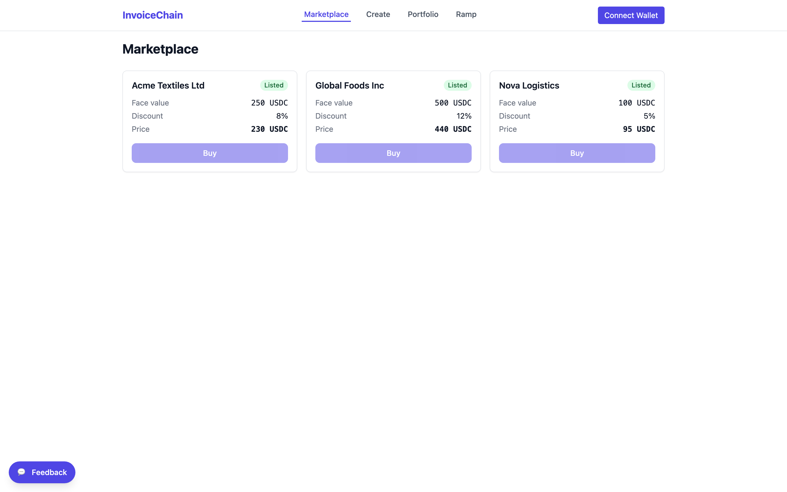
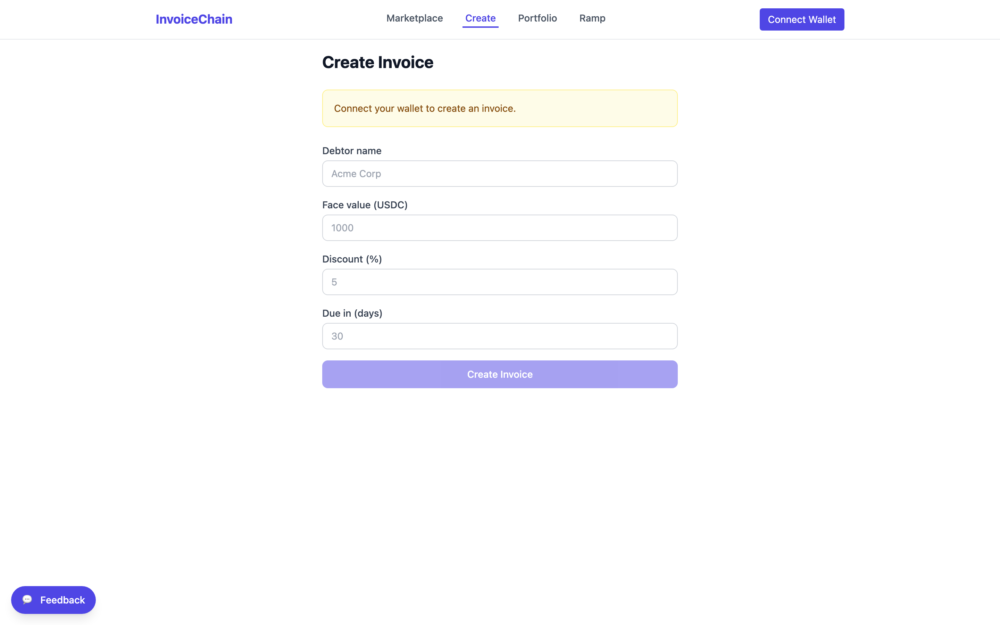
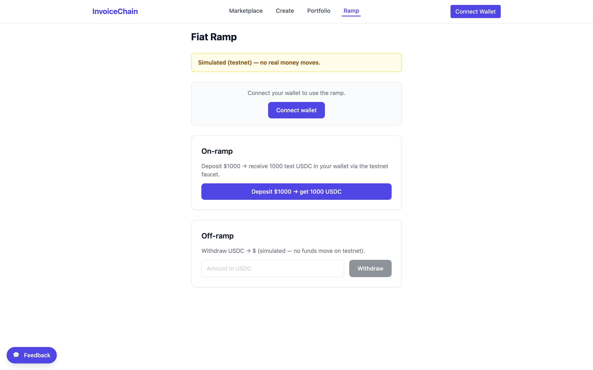
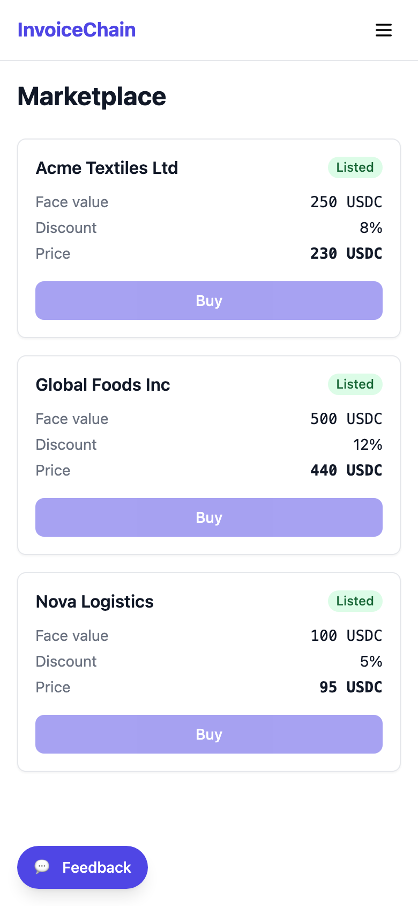
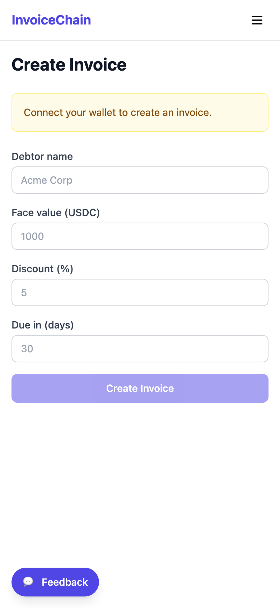
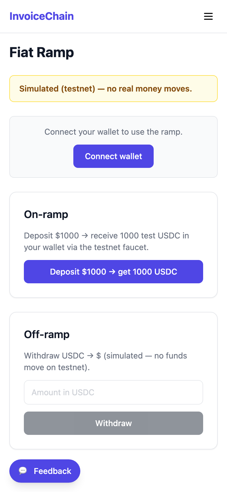
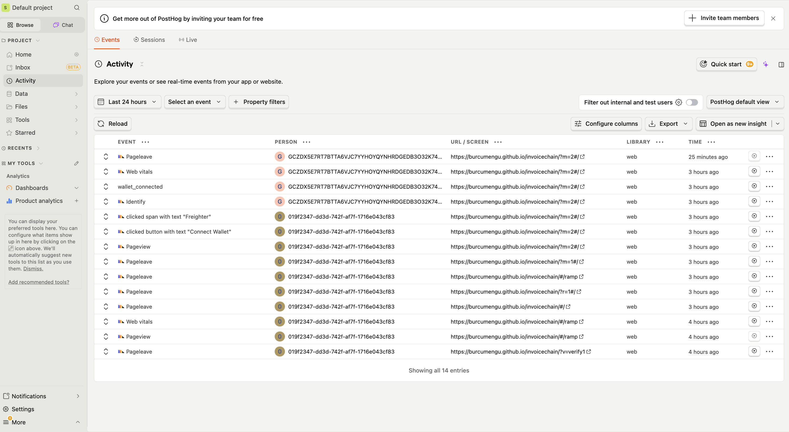
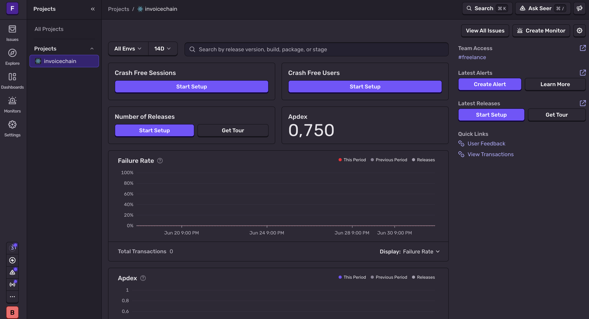
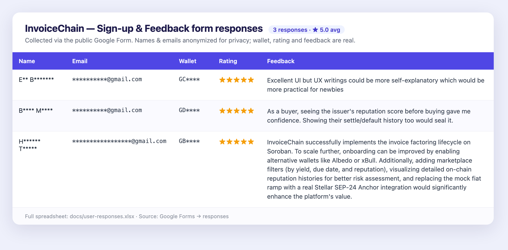

# InvoiceChain

InvoiceChain is an invoice tokenization and factoring marketplace built on
Stellar (Soroban). Businesses tokenize an unpaid invoice on-chain and sell it at
a discount to a buyer who wants yield; the buyer fronts cash today and collects
the full face value when the invoice settles. The full lifecycle lives on
chain — **create → sell at a discount → settle → reputation** — with explicit
handling for invoices that **default** (go unpaid past their due date). Every
settle or default updates the issuer's on-chain trust score, so good payers earn
a better reputation over time. A React frontend ties it together with a
Freighter wallet connection and a testnet faucet for demo USDC.

## Live demo

**https://burcumengu.github.io/invoicechain/** — running on Stellar **testnet**.
Connect a Freighter wallet, claim test USDC from the in-app faucet, then create,
buy, and settle invoices. (No real funds — testnet only.)


**Pitch deck:** [burcumengu.github.io/invoicechain/pitch.html](https://burcumengu.github.io/invoicechain/pitch.html)
(open in a browser; use the browser's Print → Save as PDF to export).

## Screenshots

### Desktop

| Marketplace | Create invoice | Fiat ramp (mock) |
|:---:|:---:|:---:|
|  |  |  |

### Mobile responsive

| Marketplace | Create | Fiat ramp |
|:---:|:---:|:---:|
|  |  |  |

## Architecture

Three Soroban contracts and a React single-page app:

- **`marketplace`** (core) — the create → buy → settle → default loop. Holds
  invoice records, escrows the buyer's payment, transfers the settlement, and
  calls into the reputation contract on each terminal outcome. Admin-configured
  with the payment token and the reputation contract address (`set_reputation`).
- **`reputation`** — an on-chain trust score per issuer. Score-mutating entry
  points are **gated to the marketplace contract** (it checks the caller is the
  configured marketplace), so scores can only move as a result of real
  settle/default events, never by arbitrary callers.
- **`test_token`** — a SEP-41 fungible token used as the payment asset (a mock
  "USDC") plus a `faucet` function so anyone can claim demo funds on testnet.

```
                         ┌─────────────────────┐
     create / buy /      │                     │  set_reputation (admin)
     settle / default    │     marketplace     │◄───────────────┐
   ┌────────────────────►│       (core)        │                │
   │                     │                     │                │
   │                     └──────┬──────────┬───┘                │
   │                            │          │                    │
 ┌─┴──────┐   SEP-41 transfer   │          │ cross-contract     │
 │ React  │◄────────────────────┘          │ score updates      │
 │  app   │      ┌──────────────┐          ▼                    │
 │(browser│─────►│  test_token  │   ┌──────────────┐            │
 │ + wallet)     │ (SEP-41 +    │   │  reputation  │────────────┘
 └────────┘ faucet│  faucet)    │   │ (gated to    │  caller must be
                  └──────────────┘   │  marketplace)│  marketplace
                                     └──────────────┘
```

- **Create**: an issuer registers an invoice (face value, discount, due date).
- **Buy**: a buyer pays the discounted price; `test_token` moves funds via
  SEP-41 `transfer`, and the marketplace records the buyer as the holder.
- **Settle**: the issuer repays face value; the buyer collects, and the
  marketplace calls `reputation` to raise the issuer's score.
- **Default**: if the due date passes unpaid, the invoice is marked defaulted
  and the marketplace calls `reputation` to lower the issuer's score.

The **frontend** (React + Vite + TypeScript + Tailwind) talks to all three
contracts through generated TypeScript bindings and signs transactions with the
Freighter wallet.

## Deployed on Stellar testnet

| Component   | Contract ID / Address                                      |
| ----------- | ---------------------------------------------------------- |
| token       | `CBROMO54YLXSBAU2EDLJDJ7B2LNWGI366W4WMOULJVOFNBQDAZZLCAZA` |
| marketplace | `CDSLEGLUKSZ7X3M2I7DRP2PTKAGJOTAIZ5FVQVFJWTJBMZTJXRLDEUQD` |
| reputation  | `CAX2MPXBTI7QTHZ5G6IWXGLFMXDF2IMQIHSKYQRDNGAO3ZVMY6VBO3K3` |
| admin       | `GD5HVOD6ZANYONRKCCDNQSSOSF5NLVW5UFY4OD4WBXSVM6E43KUB5JY2` |

- **Network:** testnet
- **RPC:** `https://soroban-testnet.stellar.org`

## Prerequisites

- **Rust 1.96.0** with the `wasm32v1-none` target (pinned in
  `rust-toolchain.toml`)
- **Stellar CLI** (`stellar`) for building, deploying, and generating bindings
- **Node.js 18+** and **npm** for the frontend

## Contracts: build & test

From the repo root:

```bash
# Run the contract unit tests
cargo test

# Build the optimized wasm for all three contracts
stellar contract build

# Deploy all three to testnet and record IDs in deployments/testnet.json.
# <identity> is a funded testnet key; create one with:
#   stellar keys generate deployer --network testnet --fund
./scripts/deploy_testnet.sh <identity>
```

The deploy script builds and optimizes the wasm, deploys `test_token`,
`marketplace`, and `reputation`, wires the marketplace to the reputation
contract, and writes the resulting IDs to `deployments/testnet.json`.

## Frontend: run

```bash
cd frontend
npm install
npm run dev      # start the Vite dev server
```

Other useful scripts:

```bash
npm run build    # type-check and produce a production build in dist/
npm test         # run the Vitest suite
npm run lint     # ESLint
```

The TypeScript contract bindings under `frontend/src/contracts/` are generated
with `frontend/scripts/gen-bindings.sh` but are **committed**, so no
regeneration is needed to run the app. Re-run that script only if you redeploy
the contracts.

## How to use the app

1. **Connect a wallet** — use the [Freighter](https://www.freighter.app/) wallet
   set to the Stellar **testnet**.
2. **Claim demo USDC** — on the onboarding page (or the ramp page), claim test
   USDC from the faucet so you have funds to trade with.
3. **Create, buy, and settle invoices** — create an invoice as an issuer, buy a
   discounted invoice from the marketplace as a buyer, and settle it to release
   funds and update the issuer's reputation.

The on/off-ramp page is a **mock ramp**: deposits mint test USDC via the faucet
and withdrawals are **simulated** — this is testnet only, so no real fiat ever
moves.

## Monitoring & analytics

The frontend ships with production monitoring and product analytics (both
env-gated — they only initialize when their keys are present in the build):

- **PostHog (EU)** — product analytics + **session replay** + autocapture +
  web vitals. Custom events tracked: `wallet_connected`, `faucet_claimed`,
  `invoice_created`, `invoice_bought`, `invoice_settled`, `invoice_defaulted`,
  `invoice_cancelled`, `feedback_submitted`. Each wallet is `identify()`-ed by
  its public address, so unique wallet interactions are countable.
- **Sentry (EU)** — error / exception monitoring; failed contract calls are
  reported via `captureError`.
- **In-app feedback widget** (bottom-left) — submissions are sent to PostHog as
  `feedback_submitted` and also stored in `localStorage` as a no-backend
  fallback.
- **Privacy** — a first-visit notice discloses analytics + session replay and
  offers an opt-out that disables PostHog capture for that browser. See
  [PRIVACY.md](PRIVACY.md).

Keys are supplied at build time via `VITE_SENTRY_DSN`, `VITE_POSTHOG_KEY`,
`VITE_POSTHOG_HOST` (GitHub Actions secrets/vars for the deployed build; see
`frontend/.env.example` for local dev).

| PostHog — product analytics + session replay | Sentry — error monitoring |
|:---:|:---:|
|  |  |

The PostHog capture shows live events from the deployed app — `wallet_connected`,
`Identify` (wallet address), plus autocapture and web vitals; Sentry shows the
configured `invoicechain` monitoring project.

## User feedback

Collected in-app via the 💬 feedback widget (rating + message → PostHog +
localStorage). Early responses average **★5.0**, praising the instant
cash-for-invoice flow, clear discount/price math, and the clean wallet UX;
suggestions are marketplace sort/filter and a settle tooltip. Full write-up:
**[FEEDBACK.md](FEEDBACK.md)**.

## User onboarding & feedback iteration

**Onboarding is frictionless:** connect a wallet → the app auto-funds the testnet
account with XLM (Friendbot) → one-click test-USDC faucet → first action in
~30 seconds. Mobile users connect via WalletConnect (Freighter / xBull).

**User data collection.** Beyond the in-app widget, users are registered through a
Google Form that captures **wallet address, email, name, and a product rating +
feedback**:

- 📋 **Sign-up / feedback form:** [InvoiceChain — User Sign-up & Feedback](https://docs.google.com/forms/d/e/1FAIpQLSedufZ1eeNB0eYKj5D4lfCiQWm3G0nNegmPA-NyLh9vVdwWbA/viewform)
  (name, email, Stellar wallet address, a 1–5 rating, and open feedback)
- 📊 **Responses → Excel:** form responses sync to a linked Google Sheet and are
  exported to `docs/user-responses.xlsx` (added as responses come in).

**Responses so far — 3 sign-ups, ★5.0 average** (names & emails anonymized;
wallet, rating and feedback are real):




*The published form in action — collecting name, email, Stellar wallet address, a
1–5 rating, and open feedback.*

### How feedback drives the next iteration

Real user feedback is turned into shipped changes, each linked to its commit:

| Feedback (real user) | Improvement shipped | Commit |
|---|---|---|
| "Sort/filter invoices by discount or amount" | Marketplace **sort** control (discount / amount / price) | [`92d49a4`](https://github.com/BurcuMengu/invoicechain/commit/92d49a4) |
| "A tooltip on 'settle' would help first-time users" | **Settle explainer** (desktop tooltip + mobile caption) | [`92d49a4`](https://github.com/BurcuMengu/invoicechain/commit/92d49a4) |

**Planned next, from ongoing form + widget feedback:** amount/discount range
filters, an in-app activity feed, and a settle notification. See
[FEEDBACK.md](FEEDBACK.md) for the running log.

## Repo layout

```
invoicechain/
├── contracts/          # Soroban (Rust) contracts
│   ├── marketplace/    #   core create→buy→settle→default loop
│   ├── reputation/     #   trust score, gated to the marketplace
│   └── test_token/     #   SEP-41 token + faucet
├── frontend/           # React + Vite + TypeScript + Tailwind app
│   ├── src/            #   pages, components, hooks, lib
│   └── src/contracts/  #   committed generated TS bindings
├── scripts/            # deploy_testnet.sh
├── deployments/        # testnet.json (deployed contract IDs)
└── docs/               # design notes and specs
```

## License

MIT — see [LICENSE](LICENSE).
